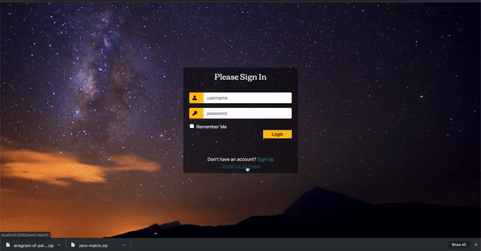
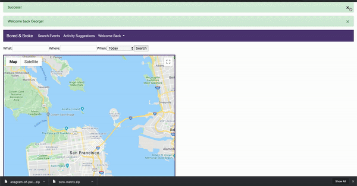
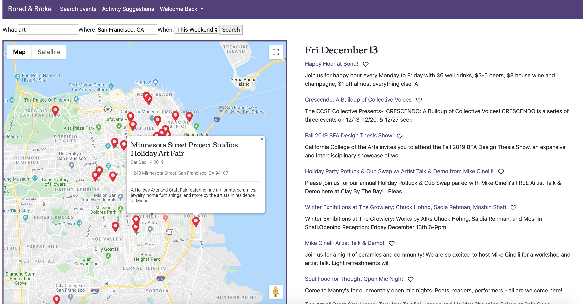
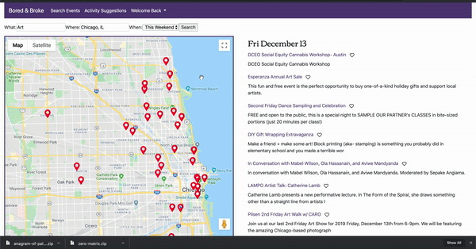
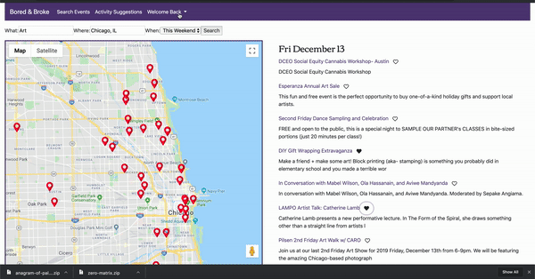
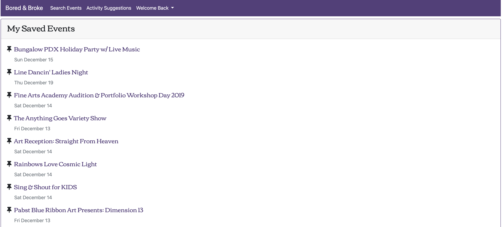

# Bored and Broke

When you need something to do but you don't have money to spend.

An application to help a user find things to do without having to fork out a bunch of cash.

Hackbright Capstone Project




<h3>The main feature is a search function to find free
events wherever you are. Those results are shown on as markers on a map, with info windows holding the event description and address</h3>


Each event title in the result list is a link to it's Eventbrite page.


<h3>Logged in users can save events</h3>


<h3>And view them from their profiles</h3>

<div>


</div>

<h3>There is also a free activity generator which shows suggestions of things to do without spending money.
The new choice button will generate an activity suggestion pulled randomly from content stored in the postgreSQL database.</h3>


## Installation

**Please Note:**<br>
<ul>
<li>**The Eventbrite Search endpoint that originally powered the event search function has been <a href="https://www.eventbrite.com/platform/docs/changelog" target="_blank">deprecated as of 12/12/2019</a>**</li>
<li>**You will need your own API key for the google maps function to work.**</li>
</ul>

Use the package manager [pip](https://pip.pypa.io/en/stable/) to install dependencies.

```bash
pip install requirements.txt
```

Create your database

```bash
createdb bored-broke-data
```

Run the model file to create tables
```bash
python3 model.py
```

Run the seed file to add data
```bash
python3 seed.py
```

If you'd like to add the mock user data in the database, uncomment the load_users and set_val_user_id function calls at the end of the seed.py file. Otherwise no users will be set.
```python
load_users()
set_val_user_id()
```

Run the server.py file to start the Flask server
```bash
python3 server.py
```
By default, server will run on port 5000


